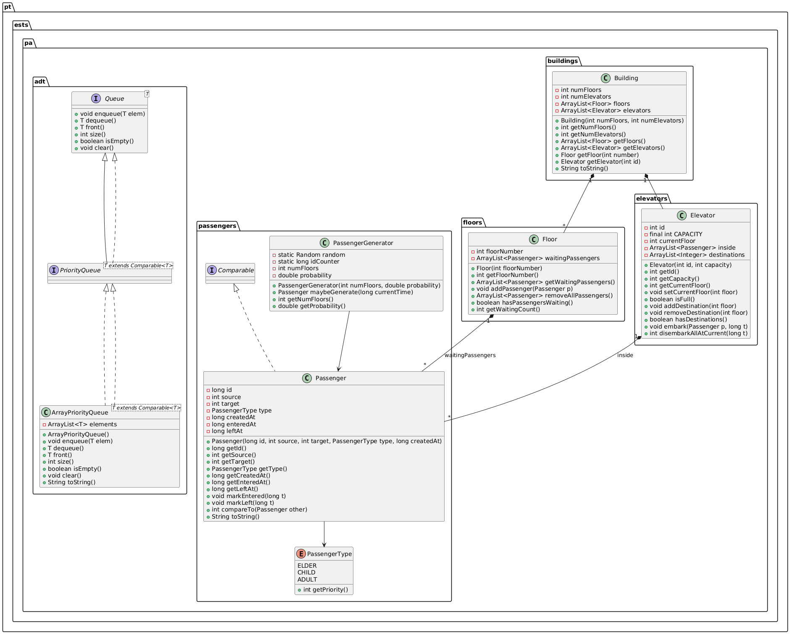
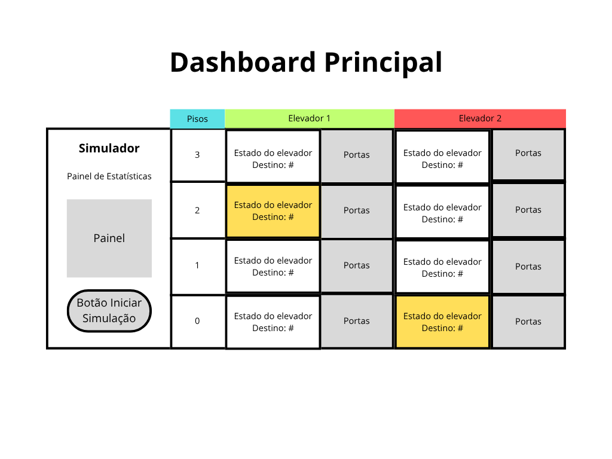
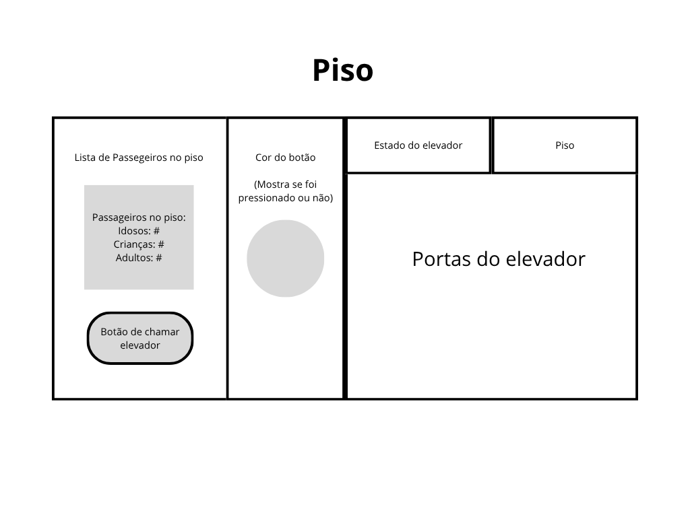
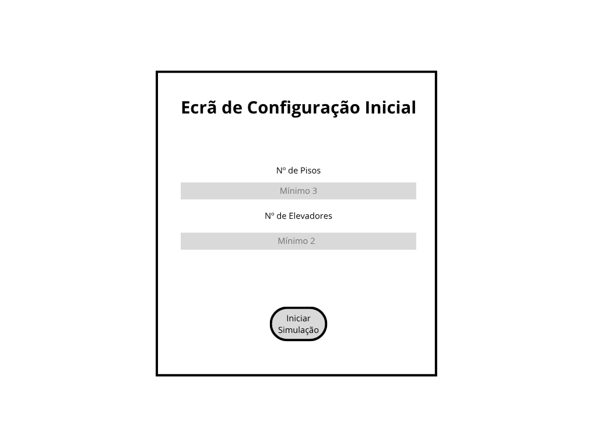

"
# 🏢 Simulador de Elevadores em Prédio Virtual
### Programação Avançada 2025/26 — Fase 3 (Entrega Final)

---

## 📘 1. Descrição do Projeto
Este projeto implementa um simulador de elevadores funcional, que representa o funcionamento interno de um edifício com pisos, elevadores e passageiros.

A **Fase 2** expandiu o modelo base, introduzindo a lógica de simulação em tempo real, gestão de estados e interfaces de visualização.

A **Fase 3 (Entrega Final)** consolida o projeto através da otimização da arquitetura via **Refactoring**, aplicação rigorosa de padrões de desenho e introdução de mecanismos de segurança.

As principais funcionalidades incluem:
- **Dois modos de visualização:** Interface Gráfica (JavaFX) e Modo Consola;
- **Motor de Simulação:** Controlo temporal e movimentação dos elevadores;
- **Padrões de Desenho:** Implementação de *Strategy* (algoritmos de decisão), *State* (estados do elevador) e *Factory* (criação de passageiros);
- **Configuração dinâmica:** Definição de nº de pisos, elevadores e tempos de simulação;
- **Estatísticas:** Monitorização de tempos de espera e passageiros transportados;
- **Refactoring & Clean Code (Novo):** Eliminação de *Code Smells* para garantir um código modular e de fácil manutenção;
- **Funcionalidade Adicional (Novo):** Implementação de um protocolo de evacuação (Modo de Emergência).

---

## 🛠️ 2. Relatório de Refactorings (Fase 3)
Para elevar a qualidade do design e reduzir o acoplamento, foram aplicadas as seguintes técnicas de refactoring baseadas no catálogo de Martin Fowler:

| Técnica | Localização | Problema Resolvido (Smell) | Descrição |
|:--- |:--- |:--- |:--- |
| **Extract Method** | `Simulation.step()` | **Long Method** | O método original realizava múltiplas tarefas. Foi decomposto em métodos privados especializados: `generatePassengers()`, `processCalls()` e `updateElevators()`. |
| **Hide Delegate** | `DashboardController` | **Message Chain** | O Controller acedia ao `Building` através da `Simulation`. Criámos métodos delegados na `Simulation` (ex: `getTotalFloors()`) para que a View não dependa da estrutura do Edifício. |
| **Replace Magic Number**| `Building.java` | **Magic Number** | Valores fixos como a capacidade padrão (6) e o mínimo de pisos (3) foram substituídos pelas constantes `DEFAULT_CAPACITY` e `MIN_FLOORS`. |
| **Hide Delegate** | `Elevator.java` | **Inappropriate Intimacy** | Criado o método `getPassengerCount()` para que a interface gráfica não tenha de aceder diretamente à lista interna de passageiros do elevador. |

---

## 🚨 3. Funcionalidade Adicional: Modo de Emergência
Como requisito da entrega final, foi implementado o **Modo de Fogo/Emergência**:
- **Ativação:** Botão dedicado na interface gráfica JavaFX.
- **Lógica de Evacuação:** Ao ser ativado, todos os elevadores cancelam imediatamente os seus destinos atuais.
- **Protocolo:** Todos os elevadores movem-se para o **Piso 0** e abrem as portas permanentemente.
- **Segurança:** Novos pedidos de passageiros e chamadas de piso são ignorados enquanto a emergência estiver ativa.

---

## 🧩 4. Estrutura do Projeto

```
src/
 ├── main/
 │   └── java/
 │       └── pt/ests/pa/
 │            ├── adt/               → Estruturas de dados genéricas
 │            ├── buildings/         → Lógica do Edifício
 │            ├── elevators/         → Elevadores e gestão de carga
 │            ├── floors/            → Pisos e filas de espera
 │            ├── gui/               → Interface JavaFX (Views e Controllers)
 │            ├── passengers/        → Passageiros e Fábricas
 │            ├── simulation/        → Motor de simulação
 │            ├── state/             → Padrão State (Idle, Moving, DoorsOpen)
 │            ├── strategy/          → Padrão Strategy (Algoritmos de elevador)
 │            ├── MainConsole.java   → Ponto de entrada (Modo Consola)
 │            └── MainJavaFX.java    → Ponto de entrada (Modo Gráfico)
 │
 └── test/
     └── java/
         └── pt/ests/pa/
            ├── ... (Testes unitários das fases anteriores)
            └── simulation/SimulationTest → Inclui agora testes de regressão do Refactoring
 │
javadoc/                             → Documentação HTML completa (Gerada na Fase 3)
```

---

## 🧱 5. Diagrama UML de Classes

O modelo segue uma arquitetura modular, organizada por pacotes, separando a lógica de negócio (Model) da visualização (View).



> **Resumo das Relações (Fase 3):**
> - `Simulation` centraliza o controlo e atua como fachada para o `Building` (Hide Delegate);
> - `Elevator` altera o seu comportamento consoante o seu `ElevatorState`;
> - As estratégias de movimento (`Strategy`) decidem qual elevador atende um pedido;
> - A `GUI` e a `Console` interagem exclusivamente com a `Simulation`, respeitando o encapsulamento.

---

## ⚙️ 6. Execução e Testes

### 🧩 Requisitos:
- **JDK 17 ou superior**
- **Maven** (para build e dependências)
- **Bibliotecas JavaFX** (geridas pelo Maven)

### ▶️ Compilar o projeto:
```bash
mvn clean compile
```

### 🧪 Executar os testes unitários e de regressão:
```bash
mvn test
```

### 📖 Gerar Documentação JavaDoc (Obrigatório Fase 3):
Para gerar o site com a documentação técnica:
1. No IntelliJ: Menu `Tools` > `Generate JavaDoc`.
2. O resultado será guardado na pasta `javadoc/`.
3. Abrir o ficheiro `index.html` para navegar na documentação.

### 🚀 6.1. Executar no Modo Consola

O modo consola corre a simulação passo a passo.

**Executar:**

```bash
mvn exec:java -Dexec.mainClass="pt.ests.pa.MainConsole"
```

**Exemplo de execução:**
Input pedido ao utilizador:

```yaml
Número de pisos: 8
Número de elevadores: 3
Capacidade dos elevadores: 5
Probabilidade de gerar passageiro (0-1): 0.25
```

**Comandos disponíveis:**

```text
ENTER  → avançar 1 step
p      → avançar 10 steps
q      → sair
```

### 🎨 6.2. Executar no Modo Gráfico (JavaFX)

**Executar UI:**

```bash
mvn exec:java -Dexec.mainClass="pt.ests.pa.MainJavaFX"
```

---

## 📅 7. Tabela de Estado do Projeto

| Tarefa | Descrição | Estado |
|--------|------------|---------|
| Simulação | Motor de tempo e lógica de movimento | ✅ Concluído |
| Padrões | Implementação de State, Strategy e Factory | ✅ Concluído |
| Visualização | Modo Consola e JavaFX funcionais | ✅ Concluído |
| **Refactoring** | Limpeza de Smells e redução de acoplamento | ✅ Concluído |
| **Emergência** | Funcionalidade adicional de segurança (Fogo) | ✅ Concluído |
| **JavaDoc** | Documentação completa da API pública | ✅ Concluído |
| **Testes** | Validação de regressão pós-refactoring | ✅ Concluído |

---

## 🎨 8. Interface Gráfica (Mockups e Implementação)

As imagens representam a disposição visual final, incluindo o painel de estatísticas, seleção de estratégias e o novo botão de emergência.





---

## 👨‍💻 Autores

**Nomes:** Diogo Brito, Diogo Gomes e Rafael Junqueira  
**Unidade Curricular:** Programação Avançada (ESTS — 2025/26)  

**Fase:** 3 — Entrega Final (Janeiro 2026)
"
