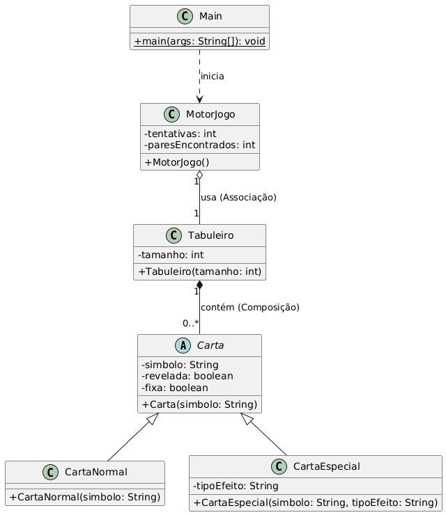

# 📝 Fase 1 – Especificação: Jogo da Memória

### 👥 Grupo `PM.08.2024151531`
*   👨‍💻 **Rafael Junqueira (Leader)** — 2024151531
*   👨‍💻 **Diogo Brito** — 2024151350

**Docente de Laboratório:** Patrícia Macedo <br>
**Aula PL:** PL8

---

### 🕹️ 1. Descrição do Jogo
O nosso projeto é um jogo de memória clássico onde o objetivo é encontrar todos os pares de símbolos numa grelha. Para tornar o jogo mais dinâmico e menos repetitivo, decidimos acrescentar cartas especiais que ativam efeitos assim que são viradas pelo jogador.

*   **🔤 Símbolos:** As cartas vão usar identificadores simples (como "A", "B" ou "C").
    *   **Consola:** Mostramos os símbolos como texto normal.
    *   **JavaFX:** Para a interface gráfica, vamos usar **Emojis** (ex: 🍎, 🍌, 🍒) para ficar visualmente mais apelativo.
*   **🃏 Cartas Especiais:** 
    *   `[!]` **Bónus:** Quando o jogador vira esta carta, ganha logo mais 3 tentativas.
    *   `[?]` **Baralhar:** Esta carta baralha todas as outras que ainda estão escondidas, dificultando a memorização.
*   **🏆 Condições de Vitória/Derrota:**
    *   **Vitória:** O jogador consegue descobrir todos os pares do tabuleiro.
    *   **Derrota:** As tentativas chegam a zero antes de todos os pares estarem feitos (o jogo começa com 15 jogadas).

---

### 🧠 2. Modelação do Domínio

Pensámos na estrutura do jogo de forma a separar bem a lógica das regras da parte visual. Isto permite que o jogo funcione da mesma maneira quer estejamos a jogar na consola ou na interface JavaFX.

#### 2.1. Identificação de Entidades e Responsabilidades

| | Entidade | Responsabilidade Principal |
| :--- | :--- | :--- |
| 🎮 | **MotorJogo** | É o "cérebro" do projeto. Controla de quem é o turno, valida se o par está correto, mexe no contador de tentativas e decide quando o jogo acaba. |
| 🗺️ | **Tabuleiro** | Serve para organizar a grelha. É esta classe que cria as cartas, baralha tudo no início e deixa o motor de jogo aceder às cartas em posições específicas. |
| 🃏 | **Carta (Abstrata)** | É a base de todas as cartas. Guarda o símbolo e diz se a carta está virada para cima ou se já foi encontrada (fixa). |
| 🃏 | **CartaNormal** | É a carta base do jogo, usada apenas para formar pares com outras iguais. |
| ✨ | **CartaEspecial** | Uma carta que, além de ser virada, tem o método `aplicarEfeito()` para mudar o estado das tentativas ou as posições no tabuleiro. |

#### 2.2. Relações Estruturais (POO)

*   **🔼 Herança:** Criámos as classes `CartaNormal` e `CartaEspecial` como subclasses de `Carta`. Isto permite-nos tratar qualquer peça no tabuleiro de forma genérica.
*   **💎 Composição:** O `Tabuleiro` é composto por uma lista de `Cartas`. Como o tabuleiro é que cria e gere as cartas, usamos uma relação de composição.
*   **🔌 Associação:** O `MotorJogo` tem uma referência ao `Tabuleiro`. Ele usa essa ligação para verificar o que está em cada posição da grelha sempre que o jogador faz uma jogada.

---

### 📊 3. Modelo de Classes (UML)

Este diagrama mostra como organizámos as classes e as ligações entre elas:



*   **Hierarquia:** Temos uma classe abstrata `Carta` que serve de molde para as outras.
*   **Encapsulamento:** Colocámos os atributos como privados (`-`) para proteger os dados. O acesso é feito através de métodos públicos.
*   **Polimorfismo:** Usamos o `@Override` no método `revelar()` dentro das subclasses. Assim, o motor de jogo chama o método sem precisar de saber se a carta é normal ou especial, e o Java executa o comportamento certo.

---

### 🖥️ 4. Protótipo da Interface Gráfica
Para a versão de texto, o jogador vai introduzir as coordenadas para escolher as cartas.

```text
Tentativas: 12 | Pares: 1/8
   0  1  2  3
0 [?] [*] [*] [!]
1 [*] [A] [A] [*]
Escolha a linha e coluna (ex: 0 1): 
```
*   `[*]` Carta que ainda está escondida.
*   `[A/B/C]` Carta normal que foi virada.
*   `[! / ?]` Carta especial que ativou o efeito.
